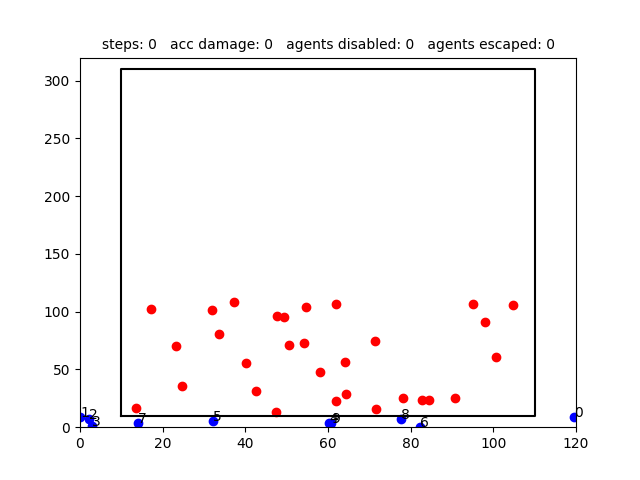

# Dynamic Swarm Disablement (DSD)

TODO abstract

## Deterministic case

### Full-blockage case

#### StaticLine

#### TravelingLine

#### SeparateTraveling

### Partial-blockage

#### StaticLineLack

#### SeparateStaticLack

#### SeparateAdditiveLack

### BaseLine

#### IterativeAssignment

#### KmeansAssignment

## Stochastic case

